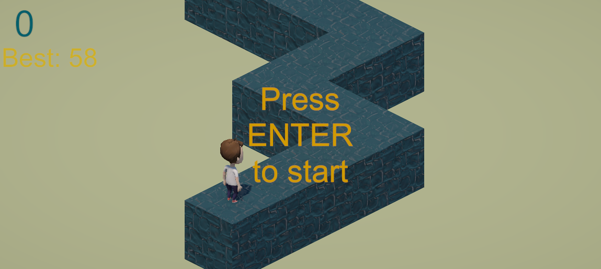

# 🏓 Zig Zag Game (Unity)

**Zig Zag** game remake built in **Unity** as part of my C# Masterclass learning journey.  
This small project focuses on procedural generation, particle physics, and storing data in PlayerPreferences in Unity.

---

## 🎮 Gameplay Overview

- Dodge obstacles
- Collect crystals
- Survive as long as possible!

---

## 🧠 Learning Focus

- 3D player movement using Rigidbody3D physics  
- Collision detection
- Designing collectible items with scoring logic  
- Useing animations and transitions via the Animator Controller  
- Visual background and use of UI elements

---

## 🕹 Controls

| Action | Key |
|:--|:--|
| Change running direction | `SPACE` |
| Start the game | `ENTER` |

---

## 📸 Screenshots

---

## ⚙️ Technical Details

- **Engine:** Unity
- **Language:** C#
- **Platform:** PC (Windows/macOS/Linux)
- **Build Target:** 3D

---

## 🧾 License

This project is part of my **C# Complete Masterclass** learning repository.  
You’re free to explore, learn, and reuse for educational purposes.  

